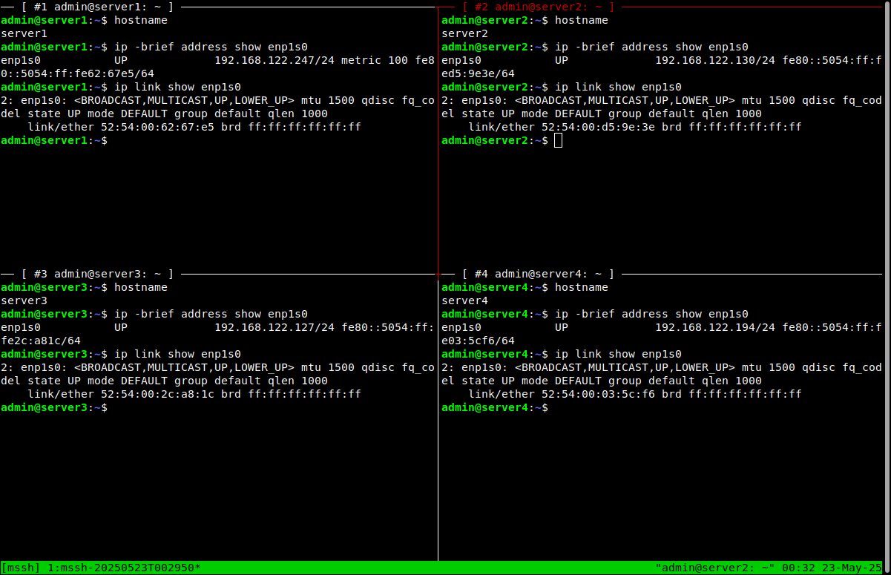

# _Multi-SSH Menu_ (`mssh-menu`)


## Description

SSH to multiple devices, splitting the screen per session, and send what is typed on the keyboard to all sessions. Instead of typing out the names of each device, select the devices via a menu which is based on information from a user created CSV file. A CSV file is required before using the program, but it is easy and straightforward to create one.

To create the CSV file, create a new file in a spreadsheet program. The first column is the list of IP addresses or hostnames. The second, third, etc. columns will be the "tags" to identify each device. A header is expected. "Host" and "Tags" will be fine for a header. Save this file with the ".csv" extension. Here is an example:

| host    | tags   |           |     |
|---------|--------|-----------|-----|
| server1 | Site 1 | Primary   | All |
| server2 | Site 1 | Redundant | All |
| server3 | Site 2 | Primary   | All |
| server4 | Site 2 | Redundant | All |

The menu is generated from the tags. The unique tags are grouped together.

Run `mssh-menu` and supply the name of the CSV file as the argument.  For example, to run `mssh-menu` with the file `examples/servers.csv`, enter the following:

```bash
mssh-menu examples/servers.csv
```

The list of tags appears on the screen. Select the tag group(s) and provide a username. An SSH session to all selected devices is created within a split screen via tmux. They keyboard input is synchronized so any commands you type go to all sessions.

_Multi-SSH Menu_ (`mssh-menu`) is written in _Python_.


## Features

- SSH to multiple devices simultaneously.
- Synchronize the keystrokes sent to all sessions.
- Create groups of devices by adding the devices and tags in a CSV file.


## Screenshots





## Installing

See the **`INSTALL`** document for instructions on how to install this program.


## Usage

Use one of the following options to learn how to use this program.


### Manual

The program's command usage and also examples are included in a document named **`MANUAL`** in various formats including pdf, markdown, and html. 

On certain platforms, usage and examples can also be found in the program's **`man`** page. On systems which utilize **`man`** pages, you can view the manual with the command **`man mssh-menu`**. 


### Help Option

You can type either **`mssh-menu -h`** or **`mssh-menu --help`** at the command line interface to see the program's options and usage.


## Examples

For examples see the **`Examples`** section in the **`MANUAL`** document. You can also see examples if you view the **`man`** page for this program.


